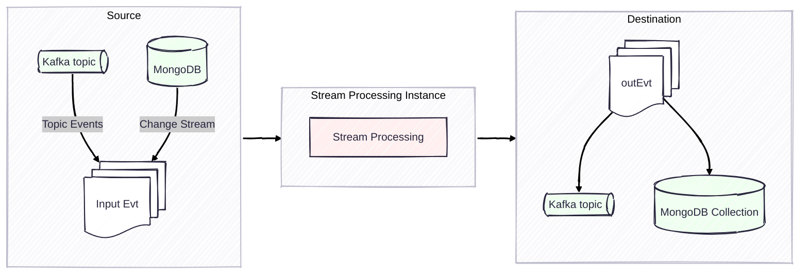
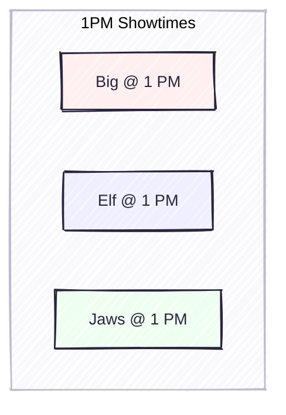
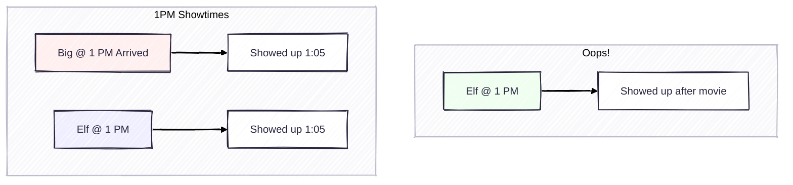
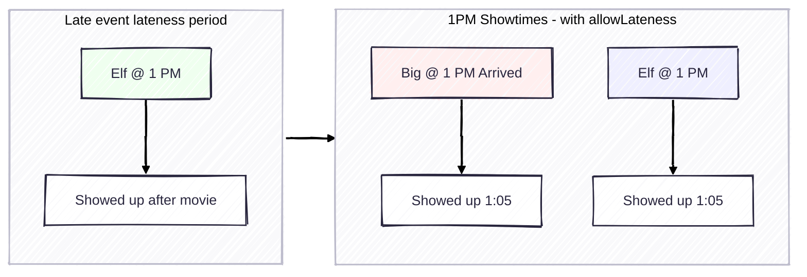
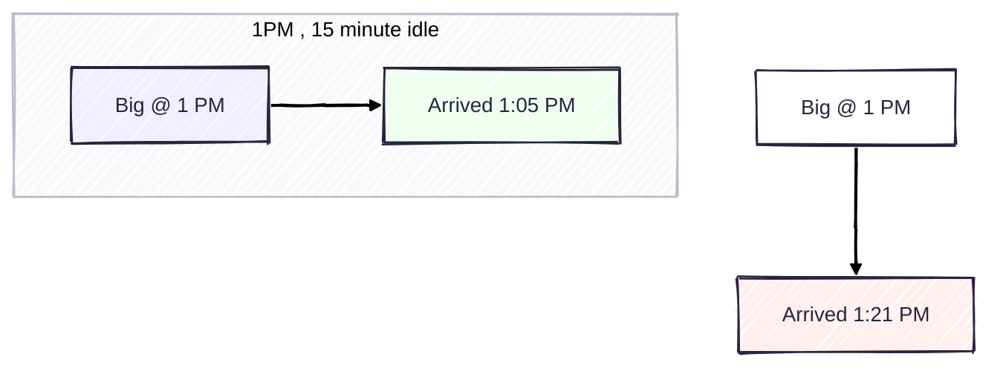

# Charts for Lightning Talk

## Tapping Into the Architecture

## Window Time, Event Time - Simple

## Tumbling Window

## Hopping WIndow

## Hopping WIndow - Sparse

### THIS IS NOT POSSIBLE! `hopSize` cannot be larger than `interval`

## Window Time, Unexpected out of window

## Window Time, allowLateness

## Window idleTime

## Session Window

