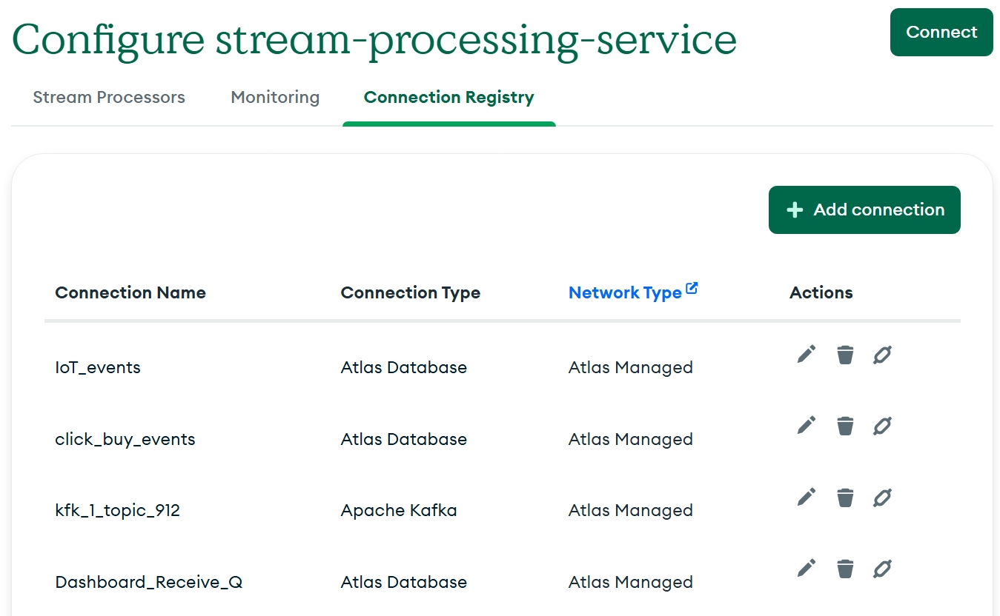
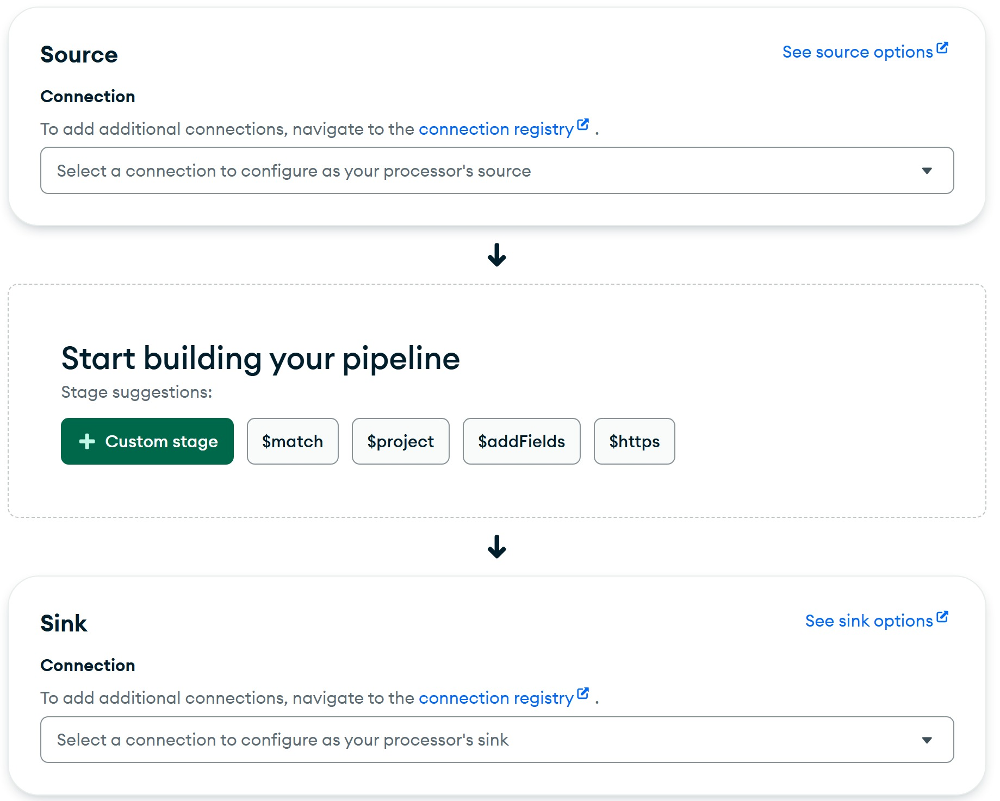
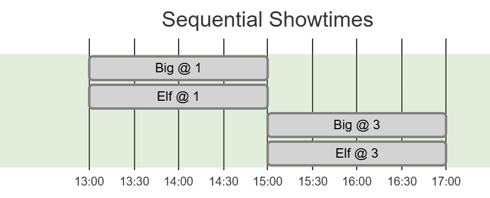
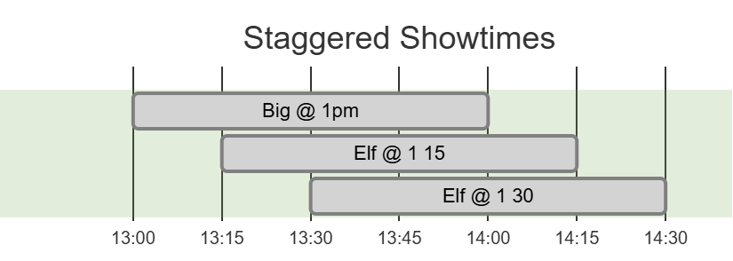

# Events at the Movies with Atlas Stream Processing

> A talk about streams of events, and making sense of them.


---

## Why?

- Event Driven Architecture
  - Lots of events, sporadic
  - Common integration pattern, existing
- Stream Analytics
  - Want to learn "what's going on"
  - "Recent Analytics", without the hotspots
  - No extra durable storage.

---

## Processing as a Pipeline


> Stream processor consumes events, and produces documents

---

## In / Out

### Connection Registry

- Kafka
- Atlas Database
- S3
...



---

## Stream Processor Connections

<div class="myColumns">
  <div class="myColumn">

`connectionName` as configured

- 1st stage: `$source`
- last state: `$merge` | `$emit | $externalFunction`

  </div>
  <div class="myColumn">

```javascript
[
  { $source: {
      connectionName: "mdbIn",
      db: "stream-demo",
      collection: "things" }},

  // { some processing stages...},
  
  { $merge:{ 
      into:{
        connectionName:"mdbConn",
        db:"db1",
        coll:"c1"} } }
]
```

  </div>
</div>

<!-- Connection names are defined in the registry -->
---

## Visual Builder

> Build and instantiate processor in Atlas.



---

## Windowing and time basis

Windows are fixed width (usually).


Output is computed on events within its time boundaries.

---

## Create Stream Processor - How?

```javascript

const pipeline = [{$source: ...}, ...];

sp.createStreamProcessor("mySP", pipeline)

```

- `pipeline` always starts with a `$source` stage.

---

## Tumbling Window



---

## Tumbling - How?

```javascript
{
  $tumblingWindow: {
    interval: { size: 2, unit: "hour" },
    pipeline: [
      { 
        $group: {
          _id: "$movie",
          total: { $sum: "$amountPaid" }
        }
      }
    ] ...
```


---

## Hopping Window



---

## Hopping - How?


```javascript
{
  $hoppingWindow:
  {
    interval: {size: 1, unit: "hour" },
    hopSize:  {size: 15, unit: "minute" },
    pipeline: [
      { 
        $group: {
          _id: "$movie",
          walkIns: { $sum: "$ticketCount" }
        } 
      }
    ] ...
```

---

## Missed the Window

Oops! What to do?


---

## Allowed Lateness

`allowedLateness` lets late arrivals to be counted after _window-end-time_.


---

## Lateness - How?


```javascript
{
  $tumblingWindow: {
    allowedLateness: { size: 10, unit: "minute"},
    interval: { size: 2, unit: "hour" },
    pipeline: [
      { $group: {
          _id: "$movie",
          total: { $sum: "$amountPaid" }
        } }
    ]
  }
}
```

---

## Idle Time

> Close the lobby early - show in progress


---

## Late Event Handling


> What happens when an event shows up **after** the window is closed?

---

## Dead Letter Queue

### What ends up in DLQ?

* Malformed
  * $validate rejections
  * Payload deserialization errors
* Time Boundary Violations (late/early)
* Aggregation pipeline stage errors
* Full Document not available (change stream)

---

## DLQ - How?

```javascript

const options = {
  dlq: {
    connectionName: "my_dlq",
    db: "my_db",
    coll: "events_for_review"
  }
}

sp.createStreamProcessor("mySP", /** pipeline */, options);
```

---

## Session Window

* Closes when no event seen `gap` time after latest.


---

## Thank You

### MongoDB Champions

Nuri Halperin

LinkedIn: @nurih

<nuri@plusnconsulting.com>


<!--
---

## Abstract

Step into the world of stream processing, where events arrive and timing matters.

This talk explores how the Atlas Stream Processor manages the journey and lifetime of an event. We will follow data events from ingestion to output and examine what happens along the way. Using a movie theater metaphor, we will explain key ideas like time windows, late arrivals, and dead letter queues. The talk connects high-level concepts to practical implementation. You will leave with a clear and useful mental model for working with real-time data.

-->