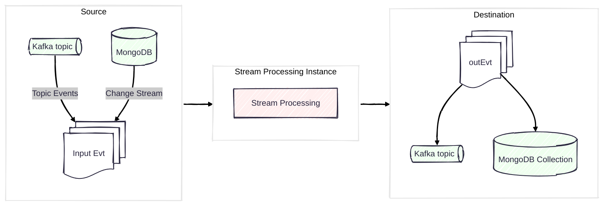
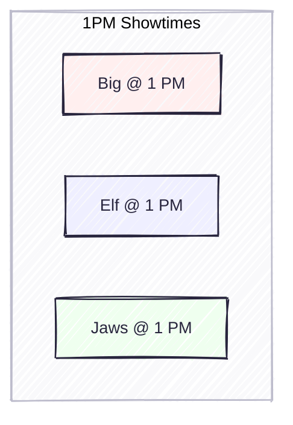
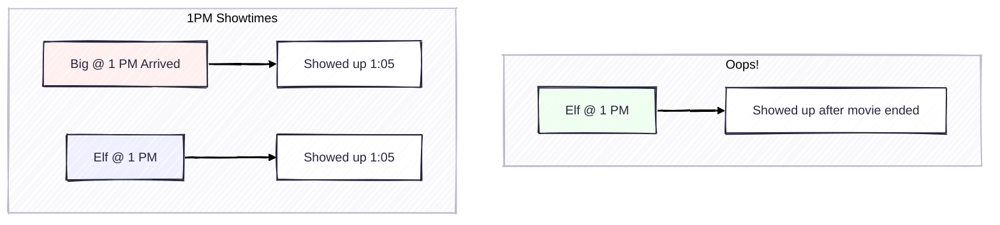
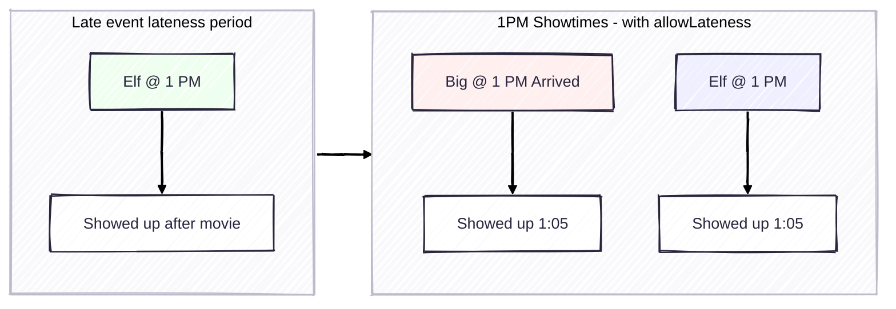
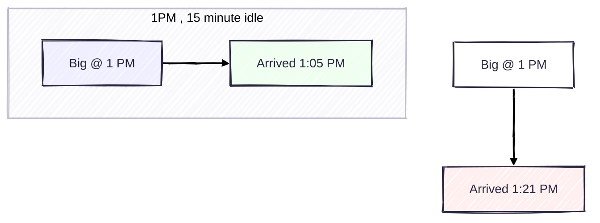

# Stream Processing at the Movies

> A talk about streams of events, and making sense of them, with a movie theater metaphore.

---

## Why?

- Event Driven Architecture
  - Lots of events, sporadic
  - Common integration pattern, existing
- Stream Analytics
  - Want to learn "what's going on"
  - "Recent Analytics", without the hotspots
  - No extra durable storage.

---

## The Big Picture

> It's about transforming sets of events into a useful output.


---

## Processing as a Pipeline



> Stream processor consumes events, and produces `SOMETHING`

---


## Why Not Database?

|SQL-land           | Streaming                 |
|----               |----                       |
|Durable            |Ephemeral                  |
|Single / Bulk      |Streaming                  |
|ACID               |At-least-once <sup>?</sup> |
|Rigid Schema       |Complex, Flexible          |

---

## A Window

Windows are a bounded view on events.

Output is a computed on events within the window.




Boundary typically time based. (Activity based sometimes)

---

## Tumbling Window

1. Shows run every 2 hours
1. Compute per-show


---

## Hopping Window

1. Theater turns-over every 2h
1. Showtimes staggered


---

## Missed the Window

Fixed-time problems...

Oops! What to do?



---

## Allowed Lateness

`allowedLateness` lets late arrivals to be counted after _window-end-time_.



---

## Idle Time

> Close the lobby early - show in progress



---

## Late Event Handling


> What happens when an event shows up **after** the window is closed?

---

## Dead Letter Queue

### What ends up in DLQ?

* Malformed
  * $validate rejections
  * Payload deserialization errors
* Time Boundary Violations (late/early)
* Aggregation pipeline stage errors
* Full Document not available (change stream)

---

## Session Window

* Closes when no event seen `gap` time after latest.


---

## Stream Processor Connections

<splits>
  <split>
    <div>

`connectionName` as configured

- First stage: `$source`
- Last stage:
  - `$merge`
  - `$emit`
  - `$externalFunction`

    </div>
  </split>
  <split>

```javascript
[
  { $source: {
      connectionName: "mdbIn",
      db: "stream-demo",
      collection: "things" }},

  // { some processing stages...},
  
  { $merge:{ 
      into:{
        connectionName:"mdbConn",
        db:"db1",
        coll:"c1"} } }
]
```

  </split>
</splits>

<!-- Connection names are defined in the registry -->

---

## Create Stream Processor - How?

```javascript

const pipeline = [{$source: ...}, ...];

sp.createStreamProcessor("mySP", pipeline)

```

- `pipeline` always starts with a `$source` stage.

---

## Tumbling - How?

```javascript
{
  $tumblingWindow: {
    interval: { size: 2, unit: "hour" },
    pipeline: [
      { 
        $group: {
          _id: "$movie",
          total: { $sum: "$amountPaid" }
        }
      }
    ] ...
```


---

## Hopping - How?


```javascript
{
  $hoppingWindow:
  {
    interval: {size: 1, unit: "hour" },
    hopSize:  {size: 15, unit: "minute" },
    pipeline: [
      { 
        $group: {
          _id: "$movie",
          walkIns: { $sum: "$ticketCount" }
        } 
      }
    ] ...
```

---

## Lateness - How?


```javascript
{
  $tumblingWindow: {
    allowedLateness: { size: 10, unit: "minute"},
    interval: { size: 2, unit: "hour" },
    pipeline: [
      { $group: {
          _id: "$movie",
          total: { $sum: "$amountPaid" }
        } }
    ]
  }
}
```

---

## DLQ - How?

```javascript

const options = {
  dlq: {
    connectionName: "my_dlq",
    db: "my_db",
    coll: "events_for_review"
  }
}

sp.createStreamProcessor("mySP", /** pipeline */, options);
```

---

## Thank You

Nuri Halperin

LinkedIn: @nurih

<nuri@plusnconsulting.com>


<!--
---

## Abstract

Step into the world of stream processing, where events arrive and timing matters.

This talk explores how the Atlas Stream Processor manages the journey and lifetime of an event. We will follow data events from ingestion to output and examine what happens along the way. Using a movie theater metaphor, we will explain key ideas like time windows, late arrivals, and dead letter queues. The talk connects high-level concepts to practical implementation. You will leave with a clear and useful mental model for working with real-time data.

-->