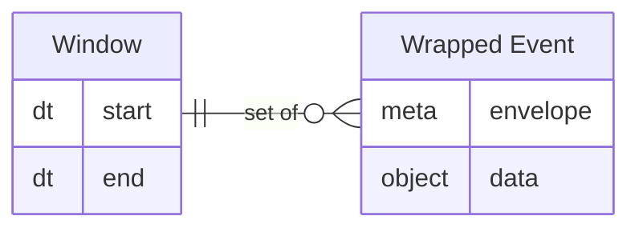

# Stream Processing

A talk about dealing with data that arrives as a stream.


---

## Agenda

1. Data streams vs. data at rest
1. Core challenges of real-time data processing
1. Powerful stream query techniques (windows, aggregations)
1. Real-time analytics patterns
1. Demo with MongoDB Atlas Stream Processor
1. Q&A


---

## "Classic" Reporting

<section class="mermaid">
```mermaid
%%{init: {'theme':'redux-color'}}%%
    sequenceDiagram
        autonumber
        participant Table as Database Table
        actor Agent as Analyst
        participant Report as Report Output
        Agent ->> Table: Query
        Table -->> Agent: "rows"
        Agent ->> Report: Render
```mermaid
</section>

_Must have database, limited scale willing to wait_


---

## Old School: Real Time

<section class="mermaid">
sequenceDiagram
    autonumber
    actor Source as Data Source
    participant Table as Table
    actor Agent as Polling Agent
    participant Report as Report Output
    rect rgb(255, 230, 150)
      Source->>Table: Write new data
      Agent->>Table: Query latest data
      Table-->>Agent: Return latest data
    end
    Agent->>Report: Output report
</section>

_Hotspot risk with timer / repeated invoke_

---

## Data at Rest vs. Data in Motion

&nbsp; | At Rest | In Motion
:--- |:--- |:---
**Durability**| Durable | Ephemeral
**Stability** | Stable | Vollatile
**Query**| Arbitrary | Predefined
**Context**| Full database| Window + Content

> Event examples: clicks, sensor data, financial transactions
---

## Stream of Events

<section class="mermaid">
timeline
    title Stream of Events
    1 : Event 1
    2 : Event 2
    3 : Event 3
    4 : Event 4
</section>

---

## Windows Over Stream

<section class="mermaid">
timeline
    title Stream of Events
    section Window 1
    1 : Event 1
    2 : Event 2
    section Window 2
    3 : Event 3
    4 : Event 4
</section>

---

## Processing a Window

<section class="mermaid">
sankey-beta
  Event 1, Aggregate  interval [t1..t2),1
  Event 2, Aggregate  interval [t1..t2),1
  Event 3, Aggregate  interval [t1..t2),1
  Event 4, Aggregate  interval [t2..t3),1
  Event 5, Aggregate  interval [t2..t3),1
  Aggregate  interval [t1..t2), Result A, 1
  Aggregate  interval [t2..t3), Result B, 1
</section>

---

## Basic Stream Processing

1. Events arrive in some _serialized_ manner
1. Stream processor _accumulates_ events given a time window
1. Once window _closes_, calculation is performed
1. Calculated result is _emitted_ (stored, ephemeral, new event)

<section class="mermaid">
flowchart LR
    S>"Incoming stream"]
    W["(Events Ti, Ti+wi)"]
    Q{{"Aggregate events in window"}}
    R((("Result W.Ti")))
    S-- accumulate -->W
    W--calculate -->Q
    Q --emit--> R
</section>

---

## Calculate

> - Isolated: only window's worth of rows
> - No JOIN (*)
> - Output emitted

```markdown
[X] select page, sum(click_count)
[_] from clicks_table
[_] where dt between(t1,t2)
[X] group by page
```

---

## Window

<section class="mermaid">

</section>

---

## Wrapped Event

**envelope** properties are set by streaming infrastructure.
**event** properties are set by sensor / producer.

<section class="mermaid">
erDiagram
    direction LR
    env["Envelope"] {
        ordinal id
        object other-meta
    }
    evt["Payload"] {
        scalar id
        any field1
        any field2
    }
    env ||--|| evt :"has"
</section>

---

## Window Types

| Window Type | Start | Overlap | Starts At | Best For |
|:----|:----|:----|:----|:----|
| Tumbling | Fixed | ❌ No | Close of last | Periodic batch-style processing |
| Hopping | Fixed | ✅ Yes | Hop interval | Rolling averages, overlap views |
| Sliding | Sliding | ✅ Yes | Regular intervals | Real-time trend detection |

---

## Tumbling Window

<section class="mermaid">
gitGraph LR:
       commit id: "t(0)"
       commit id: "t(1)"
       commit id: "t(2)"
       branch Window1
       commit id: "Calculate 0..2" type: HIGHLIGHT
       checkout main
       commit id: "t(3)"
       commit id: "t(4)"
       commit id: "t(5)"
       branch Window2
       commit id: "Calculate 3..4" type: HIGHLIGHT

</section>

* Window is fixed
* Window starts where previous ended

---

## Hopping Window

<section class="mermaid">
gitGraph LR:
       commit id: "t(0)"
       commit id: "t(1)"
       commit id: "t(2)" tag: "3 minute window"
       branch Window1
       commit id: "Calculate 0..2" type: HIGHLIGHT
       checkout main
       commit id: "t(3)"
       branch Window2
       commit id: "Calculate 1..3" type: HIGHLIGHT
       checkout main
       commit id: "t(4)"
       branch Window3
       commit id: "Calculate 2..4" type: HIGHLIGHT
</section>

- Window is fixed
- Window starts at a interval from last window start

---

## Hops Can Be Sparse

<section class="mermaid">
gitGraph LR:
       commit id: "t(0)"
       commit id: "t(1)"
       commit id: "t(2)"
       commit id: "t(3)"
       branch Window1
       commit id: "Calculate 0..2" type: HIGHLIGHT
       checkout main
       commit id: "t(4)"
       commit id: "t(5)"
       commit id: "t(6)"
       commit id: "t(7)"
       branch Window2
       commit id: "Calculate 6..7" type: HIGHLIGHT

</section>

> Hopping window can express Tumbling

---

## Challenges of Data Streams

* Non-transactional, time-relative boundaries
* Volume, velocity
* Late arrival
* "Missing" events
* Idemoptency
* Recovery from processing failure
* Reconcilliation

---

## Intro to MongoDB Atlas Stream Processor

- Brief intro
- Capabilities
- When to use it

---

## Demo

### github: /nurih/stream-processing-atlas-demo

---

## Patterns for Real-Time Insights

Commonly used patterns (Real-time dashboards, alerting, anomaly detection)

Use cases that resonate (retail, IoT, gaming, finance)

---

## Q&A / Thank You

<script type="module">
  import mermaid from "./node_modules/mermaid";
  
  mermaid.initialize({
    securityLevel: "loose",
    startOnLoad: true,
    theme: "neo",
    look: "handDrawn",
    layout: "elk",
    sankey: { showValues: false }
  }
 );
</script>
