# Stream Processing

## Querying Data Streams: Drinking from the Firehose

> _Nuri Halperin | Kansas City Developer Conference 2025_

---

## Agenda

1. Understanding data streams vs. data at rest
1. Core challenges of real-time data processing
1. Powerful stream query techniques (windows, aggregations)
1. Real-time analytics patterns
1. Demo with MongoDB Atlas Stream Processor
1. Q&A

Part 1: Conceptual Overview (Introductory - ~10 mins)

---

## "Classic" Reporting

> This works!*

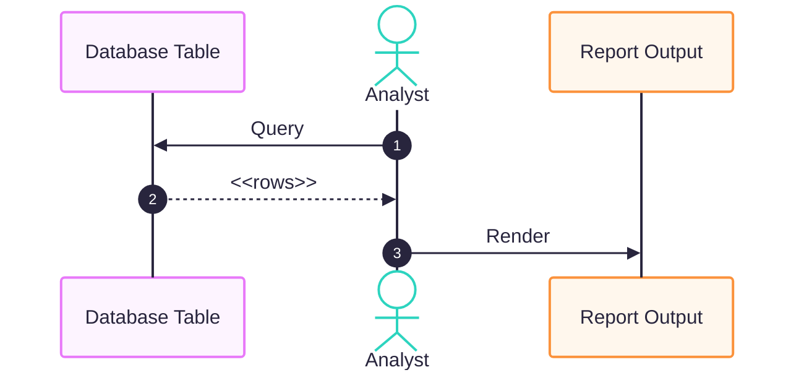

_\* Must have database, limited scale willing to wait__

---

## Old School: Real Time

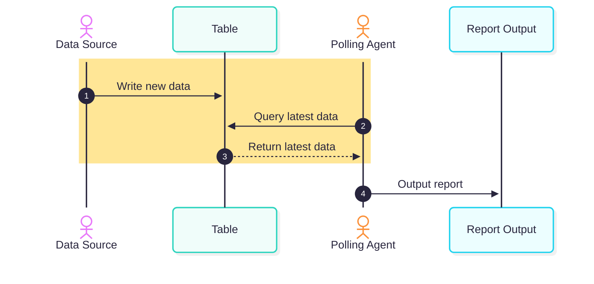

> **Note**
>
> * Hotspot
> * Timer / repeated invoke

---

## Data at Rest vs. Data in Motion

&nbsp; | At Rest | In Motion
:--- |:--- |:---
**Durability**| Durable | Ephemeral
**Stability** | Stable | Vollatile
**Query**| Arbitrary | Predefined
**Context**| Full database| Window + Content

> Event examples: clicks, sensor data, financial transactions
---

## Stream of Events

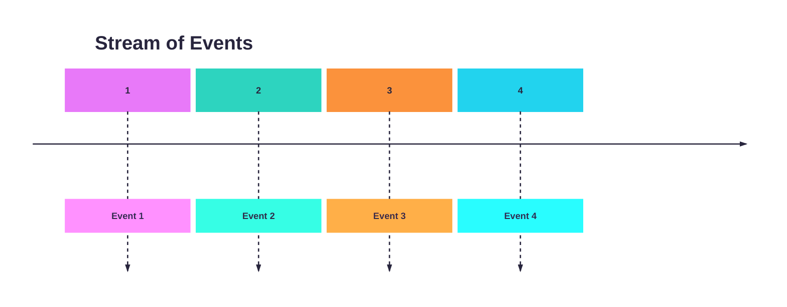

---

## Windows Over Stream

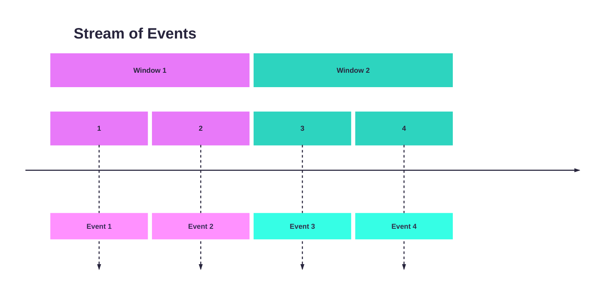

---

## Processing a Window

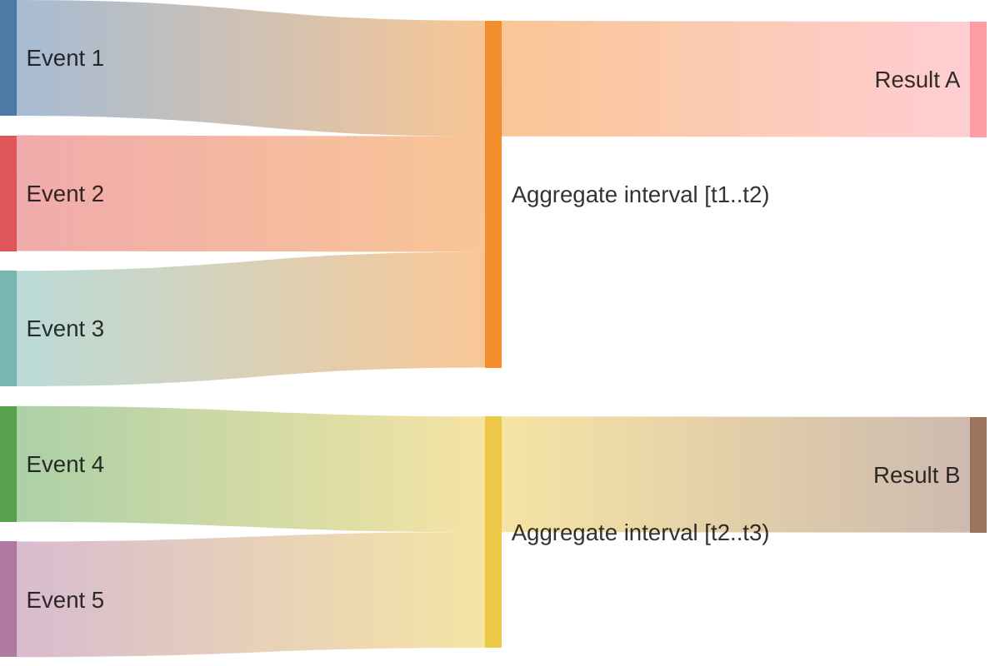

---

## Basic Stream Processing

1. Events arrive in some _serialized_ manner
1. Stream processor _accumulates_ events given a time window
1. Once window _closes_, calculation is performed
1. Calculated result is _emitted_ (stored, ephemeral, new event)

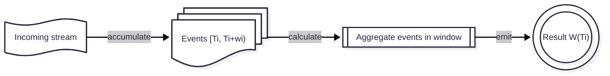

---

## Calculate

> - Isolated: only window's worth of rows
> - No JOIN (*)
> - Output emitted

```sql
[X] select page, sum(click_count)
[_] from clicks_table
[_] where dt between(t1,t2)
[X] group by page
```

---

## Window

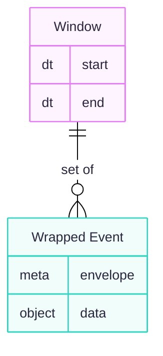

---

## Wrapped Event

**envelope** properties are set by streaming infrastructure.
**event** properties are set by sensor / producer.

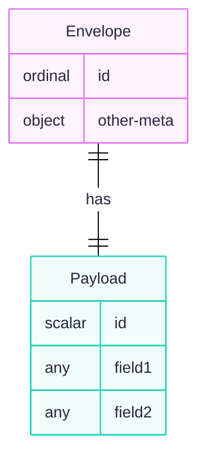

---

## Window Types

| Window Type | Start | Overlap | Starts At | Best For |
|:----|:----|:----|:----|:----|
| Tumbling | Fixed | ❌ No | Close of last | Periodic batch-style processing |
| Hopping | Fixed | ✅ Yes | Hop interval | Rolling averages, overlap views |
| Sliding | Sliding | ✅ Yes | Regular intervals | Real-time trend detection |

---

## Tumbling Window

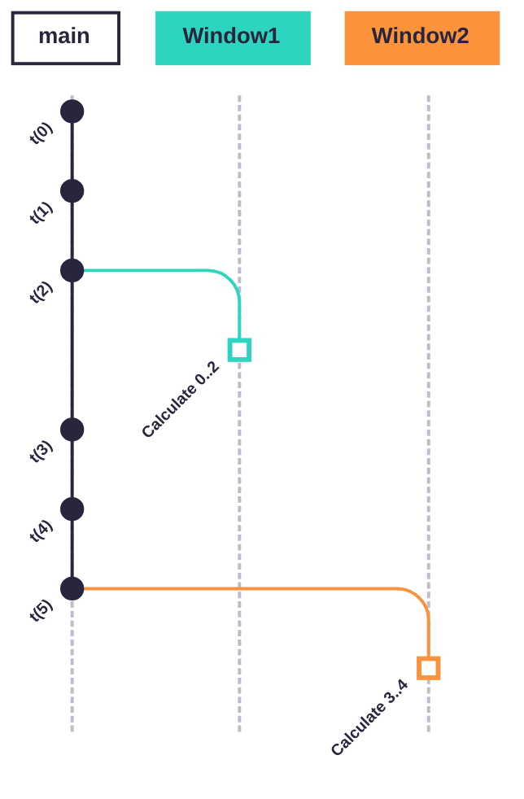

- Window is fixed
- Window starts where previous ended

---

## Hopping Window

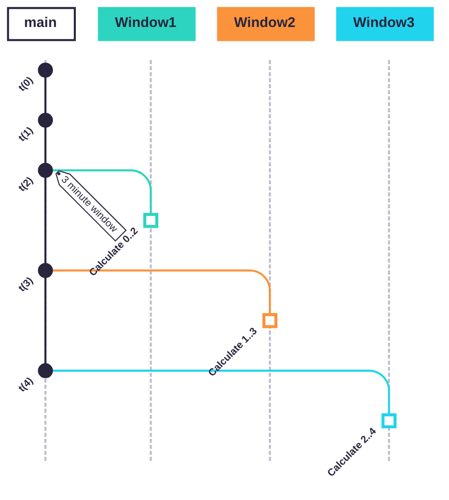

- Window is fixed
- Window starts at a interval from last window start

---

## Hops Can Be Sparse

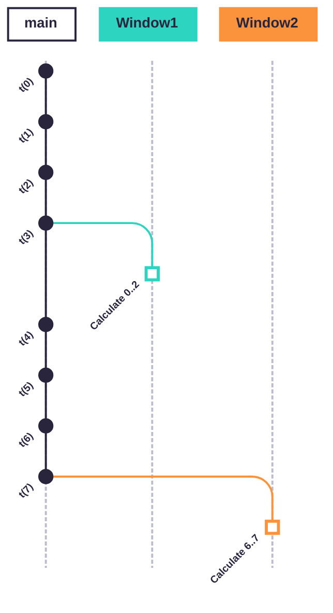

> Hopping window can express Tumbling

---

## Challenges of Data Streams

1. Non-transactional: No fixed boundaries
1. Volume, velocity
1. Late arrival
1. "Missing" events
1. Idemoptency

---

## Intro to MongoDB Atlas Stream Processor

Brief intro, capabilities, when to use it

Link to your GitHub repository (for attendees to explore)

---

## Demo

---

## Patterns for Real-Time Insights

Commonly used patterns (Real-time dashboards, alerting, anomaly detection)

Use cases that resonate (retail, IoT, gaming, finance)

---

## Q&A / Thank You

---

<script type="module">
  import mermaid from 'https://cdn.jsdelivr.net/npm/mermaid@11/dist/mermaid.esm.min.mjs';
</script>